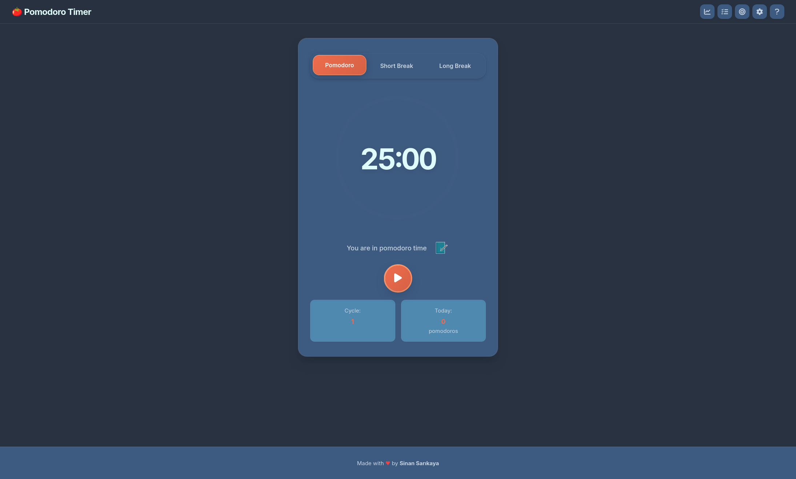

# 🍅 Modern Pomodoro Timer

<div align="center">



[](https://sinansarikaya.github.io/javascript-pomodoro-timer/)
[](https://github.com/sinansarikaya/javascript-pomodoro-timer)
[](https://www.typescriptlang.org/)
[](https://vitejs.dev/)
[](https://web.dev/progressive-web-apps/)
[](LICENSE)

**A powerful, feature-rich Pomodoro timer application built with TypeScript and Vite.**

Transform your productivity with advanced task management, goal tracking, comprehensive statistics, 15+ beautiful themes, and full keyboard navigation. Install as a PWA and work offline!

[🚀 Try Live Demo](https://sinansarikaya.github.io/javascript-pomodoro-timer/) • [✨ Features](#-features) • [📥 Installation](#-installation) • [📖 User Guide](#-usage-guide) • [📈 Version History](#-version-history)

</div>

---

## 🌟 Why This Timer?

Unlike basic pomodoro timers, this application provides a **complete productivity system**:

- 🎯 **Task-Oriented**: Link your pomodoros to specific tasks and track progress
- 📊 **Data-Driven**: Detailed statistics show where your time goes
- ⌨️ **Power User Friendly**: Full keyboard navigation for maximum efficiency
- 📱 **Works Offline**: Install as PWA and use anywhere, even without internet
- 🎨 **Personalized**: 15+ themes to match your style and mood
- 🔒 **Privacy First**: 100% local storage, no servers, no tracking
- 🌍 **Multi-language**: Turkish and English support (more coming!)

### 📈 Quick Stats

<div align="center">

| Metric | Value |
|--------|-------|
| **Lines of Code** | ~81,000+ |
| **Features** | 25+ |
| **Themes** | 15+ |
| **Languages** | 2 (TR, EN) |
| **Keyboard Shortcuts** | 11 |
| **Dependencies** | 4 (dev) |
| **Bundle Size** | Optimized with Vite |
| **Offline Support** | ✅ Full PWA |

</div>

### 🆚 Version Comparison

| Feature | v1.0 | v2.0 | v2.1 |
|---------|------|------|------|
| **Technology** | Vanilla JS | TypeScript + Vite | TypeScript + Vite + PWA |
| **Code Size** | ~5KB | ~66KB | ~81KB |
| **Task Management** | ❌ | ✅ | ✅ |
| **Goals & Statistics** | ❌ | ✅ | ✅ |
| **Themes** | ❌ | ✅ (15+) | ✅ (15+) |
| **Backup/Restore** | ❌ | ✅ | ✅ |
| **Keyboard Shortcuts** | ❌ | ❌ | ✅ (11 shortcuts) |
| **PWA Support** | ❌ | ❌ | ✅ |
| **Offline Mode** | ❌ | ❌ | ✅ |
| **Multi-language** | ❌ | ✅ | ✅ |
| **Modular Architecture** | ❌ | ✅ | ✅ |

---

## ✨ Features

### ⏱️ Smart Timer System
- **Automatic Cycling**: Seamless Pomodoro → Short Break → Pomodoro cycle
- **Long Breaks**: Automatic long break after every 4 pomodoros
- **Customizable Durations**: Pomodoro (1-60 min), Short Break (1-30 min), Long Break (1-60 min)
- **Visual Countdown**: Elegant circular progress bar with smooth animations
- **Sound Notifications**: Audio alerts for session completion
- **Desktop Notifications**: Browser notifications to keep you informed
- **Auto-start Options**: Configure auto-start for breaks and pomodoros

### 📋 Advanced Task Management
- **Rich Task Creation**: Add tasks with title, category, priority, and pomodoro count
- **5 Categories**: Work, Personal, Learning, Health, Other
- **3 Priority Levels**: High, Medium, Low with color coding
- **Recurring Tasks**: Set daily recurring tasks
- **Task Notes**: Add detailed notes to any task
- **Active Task Tracking**: Mark and track your current working task
- **Progress Monitoring**: Real-time completion percentage for each task
- **Pomodoro History**: Track pomodoros spent on each task
- **Search & Filter**: Find tasks quickly with search and category filters
- **Bulk Operations**: Complete all or delete completed tasks in one click
- **Task Archive**: Keep your task list clean with automatic archiving

### 🎯 Goal System
- **Daily Goals**: Set daily pomodoro targets to stay motivated
- **Real-time Progress**: Live progress tracking with visual indicators
- **Task Linking**: Connect tasks to specific goals
- **Active Goal Display**: See your active goal on the main screen
- **Auto Updates**: Goals update automatically as you complete pomodoros
- **Goal History**: Track your goal achievements over time

### 📊 Comprehensive Statistics
- **Total Pomodoros**: Lifetime pomodoro count
- **Total Time**: Cumulative focused work time
- **Streak Tracking**: Consecutive working days counter
- **Weekly Stats**: This week's pomodoro count
- **7-Day Activity Chart**: Visual weekly activity graph
- **Task Progress**: Overall task completion percentage
- **Category Breakdown**: See which categories you focus on most
- **Time Distribution**: Understand your productivity patterns

### 🎨 Beautiful Theme System
**15+ Pre-built Themes**:
- 🍅 Classic (Softened colors)
- 🌙 Midnight (Dark blue)
- ☀️ Daylight (Clean white)
- 🌊 Ocean (Deep blue)
- 🌲 Forest (Fresh green)
- 🌅 Sunset (Warm pastels)
- 💜 Purple Dream
- 🎯 Focus Mode (Professional dark)
- ☕ Warm Coffee (Cozy brown)
- 🍃 Mint Fresh (Cool mint)
- 💗 Pink Blossom (Soft pastels)
- 🌹 Rose Garden (Elegant rose)
- 💜 Lavender Dream
- ⚡ Neon Night (Futuristic)
- 🌿 Nature (Vibrant green)
- 🤖 Cyberpunk (Tech style)

**Theme Features**:
- Dynamic color system with CSS variables
- Automatic light/dark mode adaptation
- Smart contrast management for accessibility
- Input and button colors adapt to theme
- Smooth theme transitions

### 💾 Backup & Restore System
- **Complete Backup**: All data in a single JSON file
  - Active and archived tasks
  - Goals and progress
  - Statistics and streaks
  - Settings and preferences
  - Theme selections
  - Timer state
  - Custom themes
- **Easy Export/Import**: One-click backup and restore
- **Auto-save**: Last 5 backups automatically saved
- **Validation**: Built-in backup file validation
- **Version Control**: Timestamped backups for tracking

### 🔔 Modern Notification System
- **Toast Notifications**: Animated, non-intrusive messages
  - ✓ Success (green) - Actions completed
  - ✗ Error (red) - Something went wrong
  - ⚠ Warning (orange) - Important notices
  - ℹ Info (blue) - Helpful information
- **Auto-dismiss**: Messages disappear after 3 seconds
- **Manual Close**: Close button for instant dismissal
- **Mobile Friendly**: Responsive design for all devices
- **Smart Positioning**: Optimal placement for readability

### ⌨️ Comprehensive Keyboard Shortcuts (NEW in v2.1!)
Navigate the entire app without touching your mouse! Perfect for power users and accessibility.

**Panel Navigation**
- `T` - Toggle Tasks panel
- `G` - Toggle Goals panel
- `S` - Toggle Statistics panel
- `A` - Toggle Settings (Ayarlar) panel
- `H` - Toggle Help panel

**Timer Controls**
- `Space` - Play/Pause timer
- `R` - Reset timer
- `1` - Switch to Pomodoro mode
- `2` - Switch to Short Break mode
- `3` - Switch to Long Break mode

**General**
- `ESC` - Close any open modal or panel

All shortcuts are shown in tooltips when you hover over buttons!

### ✅ Input Validation
- **Number-only Fields**: Prevents non-numeric input
- **Range Validation**: Min/Max value enforcement
- **Clear Error Messages**: User-friendly validation feedback
- **Auto-focus**: Automatically focus on error fields
- **Negative Value Protection**: No negative time values anywhere
- **Real-time Validation**: Instant feedback as you type

### 🌍 Multi-language Support
- 🇹🇷 Turkish
- 🇬🇧 English
- Easily extensible for more languages

### 🎮 Excellent User Experience
- **Responsive Design**: Perfect on mobile, tablet, and desktop
- **Keyboard Shortcuts**: ESC to close modals, Space to pause/play
- **Click Outside**: Close panels by clicking outside
- **Panel Persistence**: Panels stay open when selecting tasks/goals
- **Smooth Animations**: Polished transitions and micro-interactions
- **Modern UI**: Clean, minimalist interface with glassmorphism effects
- **Card Layout**: Beautiful card-based timer display
- **Accessibility**: ARIA labels and keyboard navigation

---

## 🚀 Installation

### Prerequisites
- Node.js 18 or higher
- pnpm (recommended) or npm

### Quick Start

```bash
# Clone the repository
git clone https://github.com/sinansarikaya/javascript-pomodoro-timer.git
cd javascript-pomodoro-timer

# Install dependencies
pnpm install
# or
npm install

# Start development server
pnpm dev
# or
npm run dev

# Open in browser
http://localhost:5173
```

### Production Build

```bash
# Create optimized build
pnpm build
# or
npm run build

# Preview production build
pnpm preview
# or
npm run preview
```

### Deploy to GitHub Pages

```bash
# Build and deploy
pnpm build
git add dist -f
git commit -m "Deploy to GitHub Pages"
git subtree push --prefix dist origin gh-pages
```

---

## 📁 Project Structure

```
pomodoro-timer/
├── src/
│   ├── modules/              # Core modules
│   │   ├── timer.ts         # Timer management
│   │   ├── tasks.ts         # Task management
│   │   ├── goals.ts         # Goal management
│   │   ├── statistics.ts    # Statistics tracking
│   │   ├── themes.ts        # Theme management
│   │   └── settings.ts      # Settings management
│   ├── utils/               # Utility functions
│   │   ├── audio.ts         # Audio management
│   │   ├── storage.ts       # LocalStorage wrapper
│   │   ├── backup.ts        # Backup/restore system
│   │   ├── toast.ts         # Toast notifications
│   │   └── i18n.ts          # Internationalization
│   ├── types/               # TypeScript types
│   │   └── index.ts         # Type definitions
│   ├── main.ts              # Application entry point
│   ├── style.css            # Base styles
│   └── modern-styles.css    # Modern UI styles
├── public/                  # Static assets
│   ├── sounds/              # Audio files
│   └── favicon.svg          # App icon
├── index.html               # Main HTML file
├── package.json             # Dependencies
├── tsconfig.json            # TypeScript config
├── vite.config.ts           # Vite configuration
└── README.md                # This file
```

---

## 🎯 Usage Guide

### Starting the Timer
1. Select your desired mode (Pomodoro/Short Break/Long Break)
2. Click the Play button in the center
3. Timer will automatically cycle through modes
4. Work during Pomodoro, rest during breaks

### Adding Tasks
1. Click the Tasks icon in the top-right menu
2. Enter task title
3. Select category, priority, and pomodoro count
4. Optionally add notes
5. Click "Add" button
6. Set as active to track pomodoros for this task

### Creating Goals
1. Click the Goals icon in the top-right menu
2. Enter goal title
3. Set daily pomodoro target (1-50)
4. Click "Add" button
5. Set as active to track progress
6. Goals automatically update as you complete pomodoros

### Backing Up Data
1. Click the Settings icon
2. Scroll to "Backup & Restore" section
3. Click "Download Backup" to export data
4. Click "Upload Backup" to restore from file
5. Backups include all tasks, goals, stats, and settings

### Changing Themes
1. Open Settings panel
2. Navigate to Theme section
3. Click any theme to apply instantly
4. Theme preference is automatically saved

### Viewing Statistics
1. Click the Statistics icon
2. View total pomodoros, time, and streak
3. Check weekly activity chart
4. Monitor task completion progress

### Installing as PWA (Progressive Web App)
**Desktop (Chrome, Edge, Brave)**
1. Visit the [live demo](https://sinansarikaya.github.io/javascript-pomodoro-timer/)
2. Click the install icon (⊕) in the address bar
3. Click "Install" in the popup dialog
4. The app will open in its own window
5. Find it in your app launcher like any native app

**Mobile (iOS Safari)**
1. Open the app in Safari
2. Tap the Share button
3. Scroll down and tap "Add to Home Screen"
4. Tap "Add"

**Mobile (Android Chrome)**
1. Open the app in Chrome
2. Tap the three dots menu
3. Tap "Add to Home Screen" or "Install App"
4. Tap "Install"

**Benefits of PWA Installation:**
- Works completely offline after first load
- Dedicated app window without browser UI
- Faster startup time
- Native-like experience
- Automatic updates

### Using Keyboard Shortcuts
See the [Keyboard Shortcuts](#️-comprehensive-keyboard-shortcuts-new-in-v21) section for the complete list. All shortcuts work globally when the app is focused!

---

## 🛠️ Technologies

<div align="center">

| Technology | Purpose |
|------------|---------|
| **TypeScript** | Type-safe development |
| **Vite** | Fast build tool and dev server |
| **Vite PWA Plugin** | Progressive Web App functionality |
| **CSS3** | Modern styling with custom properties |
| **LocalStorage** | Client-side data persistence |
| **Service Workers** | Offline support and caching |
| **Web Audio API** | Sound notifications |
| **Notification API** | Desktop notifications |
| **Font Awesome** | Beautiful icons |
| **Lordicon** | Animated icons |

</div>

---

## 📊 Feature Checklist

| Feature | Status | Version | Description |
|---------|--------|---------|-------------|
| ⏱️ Timer System | ✅ | v1.0 | Pomodoro, short break, long break |
| 🔄 Auto Cycling | ✅ | v2.0 | Automatic mode transitions |
| 📋 Task Management | ✅ | v2.0 | Full CRUD with categories |
| 🎯 Goal System | ✅ | v2.0 | Daily targets and tracking |
| 📊 Statistics | ✅ | v2.0 | Comprehensive analytics |
| 🎨 15+ Themes | ✅ | v2.0 | Beautiful pre-built themes |
| 💾 Backup/Restore | ✅ | v2.0 | Full data export/import |
| 🔔 Toast Notifications | ✅ | v2.0 | Modern alert system |
| ✅ Input Validation | ✅ | v2.0 | Smart form validation |
| 🌍 Multi-language | ✅ | v2.0 | Turkish & English |
| 📱 Responsive Design | ✅ | v2.0 | Mobile, tablet, desktop |
| 🔊 Sound Alerts | ✅ | v1.0 | Audio notifications |
| 🖥️ Desktop Notifications | ✅ | v2.0 | Browser notifications |
| 🔁 Recurring Tasks | ✅ | v2.0 | Daily task repetition |
| 📈 Progress Tracking | ✅ | v2.0 | Real-time progress bars |
| 🔍 Search & Filter | ✅ | v2.0 | Advanced task filtering |
| 📝 Task Notes | ✅ | v2.0 | Detailed note system |
| 🎴 Card UI | ✅ | v2.0 | Modern card-based layout |
| 🍃 Glassmorphism | ✅ | v2.0 | Beautiful glass effects |
| ⌨️ Keyboard Shortcuts | ✅ | v2.1 | Full keyboard navigation |
| 📱 PWA Support | ✅ | v2.1 | Install as app, offline mode |
| 🚀 Auto Deploy | ✅ | v2.1 | GitHub Pages deployment |

---

## 🔒 Privacy & Security

- ✅ **100% Local**: All data stored in browser's LocalStorage
- ✅ **No Server**: No data sent to any external server
- ✅ **Offline First**: Works completely offline
- ✅ **Your Control**: You own and control all your data
- ✅ **No Tracking**: No analytics or tracking scripts
- ✅ **Open Source**: Transparent and auditable code

---

## 🤝 Contributing

Contributions are welcome! Here's how you can help:

1. **Fork** the repository
2. **Create** a feature branch (`git checkout -b feature/amazing-feature`)
3. **Commit** your changes (`git commit -m 'Add amazing feature'`)
4. **Push** to the branch (`git push origin feature/amazing-feature`)
5. **Open** a Pull Request

### Development Guidelines
- Follow TypeScript best practices
- Maintain consistent code style
- Add comments for complex logic
- Test thoroughly before submitting
- Update documentation if needed

---

## 📝 License

This project is licensed under the MIT License - see the [LICENSE](LICENSE) file for details.

---

## 👨‍💻 Author

**Sinan Sarıkaya**

- GitHub: [@sinansarikaya](https://github.com/sinansarikaya)
- Project: [JavaScript Pomodoro Timer](https://github.com/sinansarikaya/javascript-pomodoro-timer)
- Live Demo: [Try it now!](https://sinansarikaya.github.io/javascript-pomodoro-timer/)

---

## 🙏 Acknowledgments

- [Font Awesome](https://fontawesome.com/) - Icon library
- [Lordicon](https://lordicon.com/) - Animated icons
- [Vite](https://vitejs.dev/) - Next generation build tool
- [TypeScript](https://www.typescriptlang.org/) - JavaScript with types
- [Pomodoro Technique](https://francescocirillo.com/pages/pomodoro-technique) - Time management method

---

## 📞 Contact & Support

- 🐛 **Bug Reports**: [Open an issue](https://github.com/sinansarikaya/javascript-pomodoro-timer/issues)
- 💡 **Feature Requests**: [Start a discussion](https://github.com/sinansarikaya/javascript-pomodoro-timer/discussions)
- 📧 **Email**: Contact through GitHub

---

## 📈 Version History

### v2.1.0 (Current)
**Enhanced Accessibility & PWA Support**

#### 🎯 Major Features
- ⌨️ **Comprehensive Keyboard Shortcuts System**
  - Full keyboard navigation throughout the app
  - Smart tooltip system showing shortcuts on hover
  - Global shortcuts: T (Tasks), G (Goals), S (Statistics), A (Settings), H (Help)
  - Timer controls: Space (Play/Pause), R (Reset), 1/2/3 (Mode switch)
  - ESC to close any modal or panel

- 📱 **Progressive Web App (PWA)**
  - Install as standalone desktop/mobile app
  - Offline-first architecture with service workers
  - App icons and splash screens for all devices
  - Enhanced manifest with proper metadata
  - Works seamlessly offline after first load

- 🚀 **Automated Deployment**
  - GitHub Pages deployment script (`npm run deploy`)
  - Automated build and deploy workflow
  - Easy updates and version management

#### 🎨 UI/UX Improvements
- Refined recurring task UI with smooth animations
- Enhanced modal designs (simplified goal editor to 3 essential fields)
- Perfect timer circle centering and alignment
- Better button tooltips with contextual keyboard shortcuts
- Improved visual feedback for all interactions

#### 🐛 Bug Fixes & Stability
- Fixed form validation edge cases
- Resolved task editing functionality issues
- Improved modal closing behavior consistency
- Enhanced keyboard shortcut reliability across browsers
- Better handling of rapid user interactions

#### 📦 Technical Improvements
- Code size growth: +23% (81KB main.ts vs 66KB in v2.0)
- Styles expansion: +37% (54KB CSS vs 39KB in v2.0)
- New dependencies: gh-pages, vite-plugin-pwa, PWA asset generator
- Improved TypeScript type coverage
- Better error handling and validation

---

### v2.0.0 
**Complete Rewrite & Modernization**

#### 🏗️ Architecture Overhaul
- **Technology Migration**
  - Migrated from Vanilla JavaScript to **TypeScript**
  - Introduced **Vite** as modern build tool (replacing simple HTML/CSS/JS)
  - Implemented modular architecture with separate modules
  - Type-safe development with comprehensive TypeScript types

#### 📂 New Project Structure
- `src/modules/`: Core feature modules (timer, tasks, goals, statistics, themes, settings)
- `src/utils/`: Utility functions (audio, storage, backup, toast, i18n)
- `src/types/`: TypeScript type definitions
- Modern development workflow with hot module replacement

#### ✨ Core Features Introduced
- **Advanced Task Management**
  - 5 categories (Work, Personal, Learning, Health, Other)
  - 3 priority levels with color coding
  - Recurring tasks support
  - Task notes and detailed tracking
  - Search and filter functionality

- **Goal System**
  - Daily pomodoro targets
  - Real-time progress tracking
  - Task-goal linking
  - Achievement history

- **Statistics Dashboard**
  - Total pomodoros and time tracking
  - Streak counter for consecutive days
  - Weekly activity charts (7-day graph)
  - Category breakdown analysis
  - Task completion percentages

- **Theme System**
  - 15+ pre-built beautiful themes
  - Dynamic CSS custom properties
  - Light/dark mode adaptation
  - Smooth theme transitions

- **Backup & Restore**
  - Complete data export/import as JSON
  - Auto-save last 5 backups
  - Validation and version control
  - One-click backup download/restore

- **Modern Notification System**
  - Toast notifications (success, error, warning, info)
  - Auto-dismiss with manual close option
  - Animated, non-intrusive design

- **Input Validation**
  - Number-only fields with range enforcement
  - Real-time validation feedback
  - Clear error messages
  - Negative value protection

- **Multi-language Support**
  - Turkish and English translations
  - Extensible i18n system

#### 🎨 UI/UX Design
- Complete visual redesign with modern card layout
- Glassmorphism effects throughout the interface
- Smooth animations and micro-interactions
- Clean header with organized menu system
- Refined themes (Sunset, Rose Garden, etc.)
- Responsive design for mobile, tablet, desktop
- Modern color schemes with accessibility focus

#### 📊 Code Metrics
- ~66KB main TypeScript file (vs ~5KB JavaScript in v1)
- ~39KB modern CSS styles
- 6 core modules + 5 utility modules
- Comprehensive type system

---

### v1.0.0 (Initial Release)
**Simple Pomodoro Timer**

#### 📱 Basic Features
- ⏱️ Simple Pomodoro timer (25 min work, 5 min break)
- Basic timer modes: Pomodoro, Short Break, Long Break
- Circular progress visualization
- Play/Pause/Reset controls
- Sound notifications
- Social media links

#### 🛠️ Technology Stack
- Pure Vanilla JavaScript (~5KB app.js)
- HTML5 & CSS3
- Font Awesome icons
- Lordicon animated icons
- No build tools or dependencies

#### 📏 Scope
- Single-file JavaScript application
- Simple, focused functionality
- Educational project demonstrating Pomodoro technique
- Static HTML deployment

#### 🎯 Purpose
- Learning project for DOM manipulation
- Introduction to timer logic and animations
- Basic event handling and state management

---

## 🗺️ Roadmap

### Version 3.0 (Planned - Major Features)
- [ ] **Cloud Sync Support**: Sync data across devices with user accounts
- [ ] **Browser Extension**: Chrome, Firefox, Edge extensions for quick access
- [ ] **Mobile App**: React Native mobile applications (iOS & Android)
- [ ] **Team Collaboration**: Share tasks and goals with team members
- [ ] **Calendar Integration**: Google Calendar, Outlook, Apple Calendar sync
- [ ] **AI-Powered Suggestions**: Smart task prioritization and time estimates

### Version 2.2 (Next Minor Release)
- [ ] **Custom Sound Uploads**: Upload your own notification sounds
- [ ] **Export Statistics**: PDF/CSV export for productivity reports
- [ ] **Pomodoro Tutorials**: Interactive onboarding guide for new users
- [ ] **Auto Dark Mode**: Automatic theme switching based on time of day
- [ ] **Advanced Analytics**: Detailed productivity insights and trends
- [ ] **Task Templates**: Reusable task templates for common workflows
- [ ] **Focus Music**: Built-in focus music player integration (Spotify, YouTube)
- [ ] **Break Suggestions**: AI-powered break activity suggestions
- [ ] **Subtasks**: Add subtasks to main tasks for better organization
- [ ] **Time Estimates**: Estimate completion time for tasks

---

## ⭐ Star History

## 📦 Deployment

### GitHub Pages
```bash
# Build the project
npm run build

# Deploy to GitHub Pages
npm run deploy
```

### Manual Deployment
1. Run `npm run build` to create the `dist` folder
2. Push the `dist` folder contents to the `gh-pages` branch
3. Enable GitHub Pages in repository settings

---

If you find this project useful, please consider giving it a star! It helps others discover the project and motivates continued development.

<div align="center">

[](https://star-history.com/#sinansarikaya/javascript-pomodoro-timer&Date)

</div>

---

<div align="center">

**Made with ❤️ by Sinan Sarıkaya**

[⬆ Back to Top](#-pomodoro-timer)

</div>
